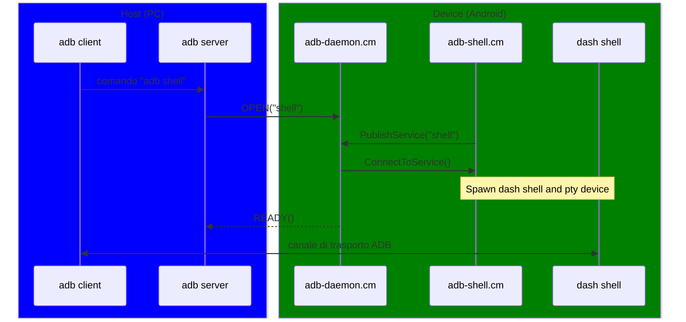

# ADB: Android Debugging Bridge

ADB è un tool CLI sviluppato da Google che comunica con un dispositivo Android.

Si può dividere in tre componenti principali:
- **Daemon** - adbd, il demone di adb, è un processo che gira sul dispositivo Android
- **Server** - Il server gira sul PC sulla porta 5037, e gestisce la comunicazione tra client e demone
- **Client** - Il client gira anch'esso sul PC. Invia i comandi inseriti dall'utente alle API del server

Alcuni comandi ADB utili:
- `adb devices`
- `adb pair <ip>:<port> <pairing code>`
- `adb tcpip <port>`
- `adb shell`
- `adb push <local file> <remote file>`
- `adb pull <remote file> <local file>`

---
level: 2
title: Sequence Diagram
---

# Sequence Diagram di ADB

